## 1.Input system

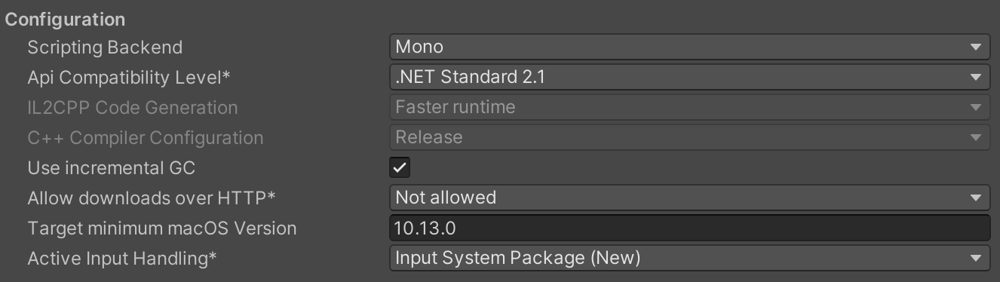

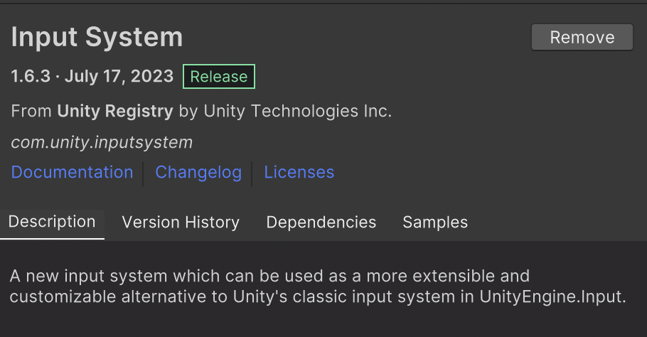

### (1) 移动

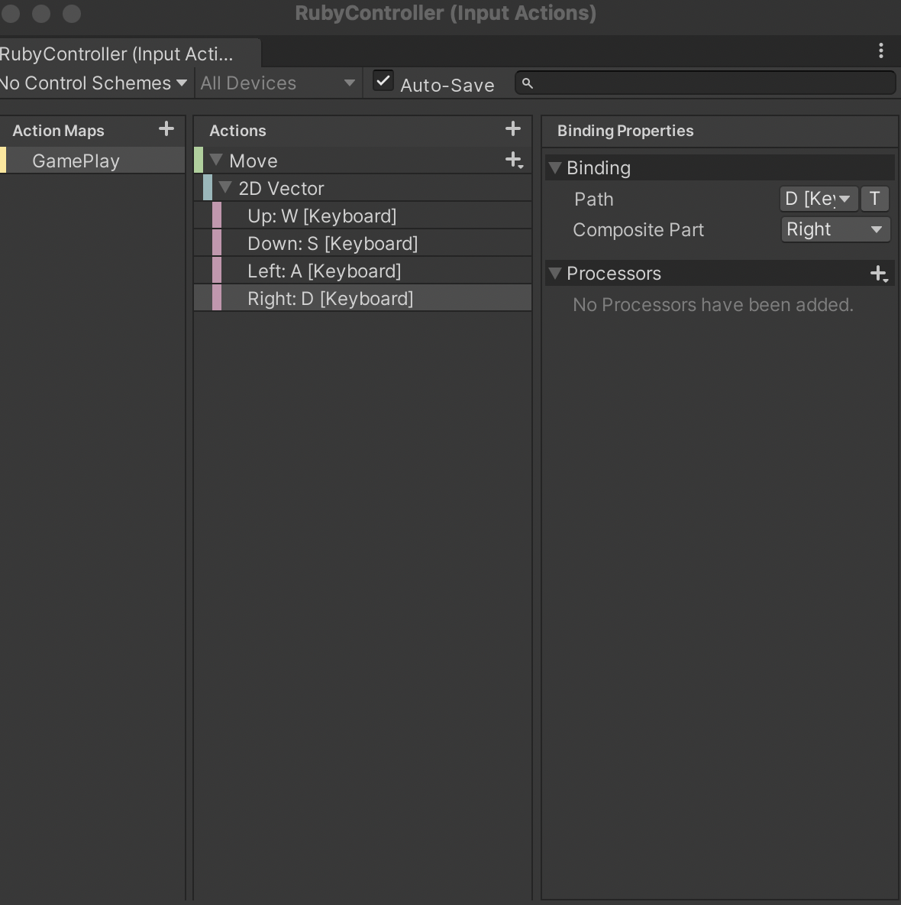

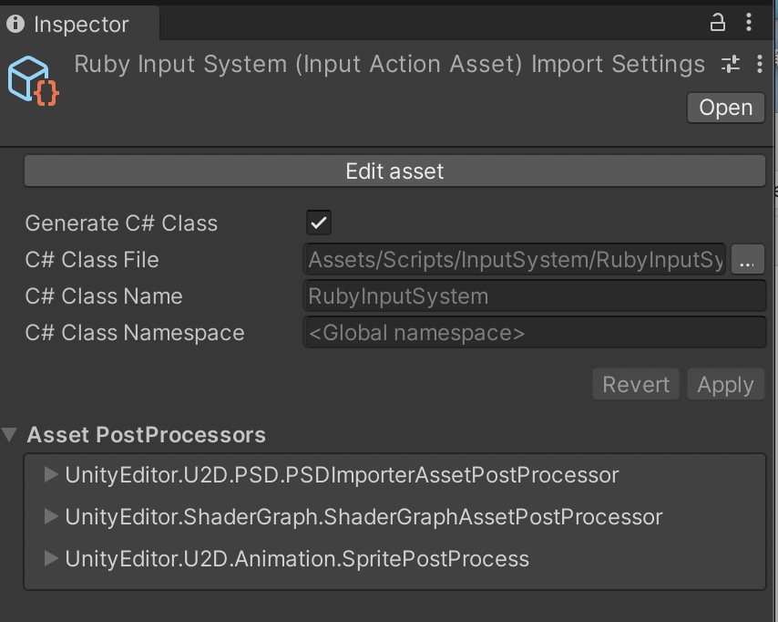

```c#
private RubyInputSystem inputSystem;
public float speed;

private void Awake()
{
    inputSystem = new RubyInputSystem();
}

private void OnEnable()
{
    inputSystem.Enable();
}
private void OnDisable()
{
    inputSystem.Disable();
}

private void Update()
{
    Vector2 direction = inputSystem.GamePlay.Move.ReadValue<Vector2>();
        
    transform.position += (Vector3)direction * speed * Time.deltaTime;
}

```

---

## 2.Tile Map

### (1) 新建Tilemap

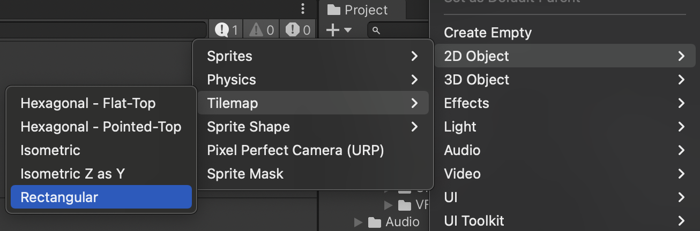

### (2) 新建Palette

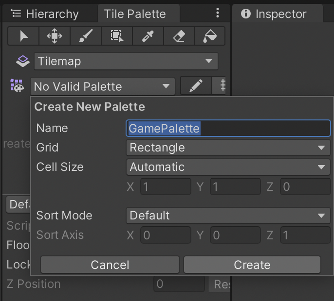

### (3) 创建Tile

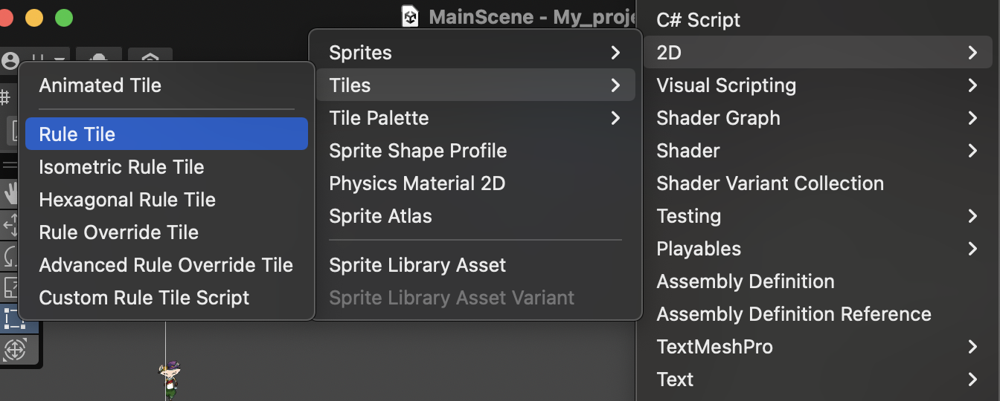

创建完后添加sprite，注意Pixels Per Unit设置为和图像相同的大小，如64乘64就设为64、16乘16就设为16；如果是组合图片，首先设置sprite mode为multiple，再使用总像素除以切分的数量得出pixel per unit（192乘192 / 9 = 64乘64））

创建好后将Tile拖入Pattle即可

### (4) Rule Tile

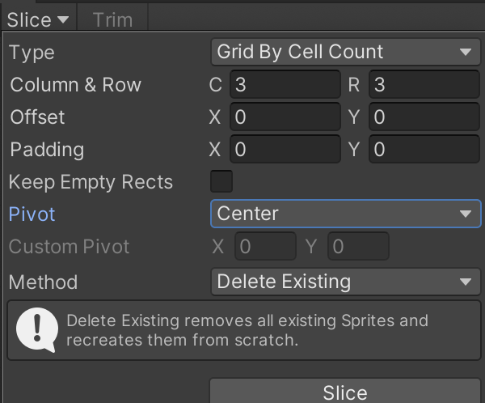

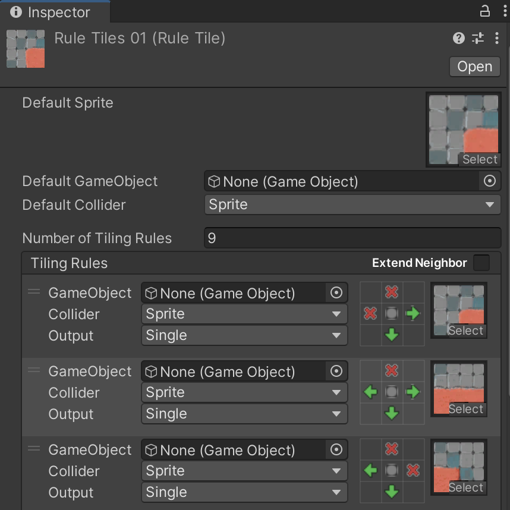

### (5) Rule Override Tile

即可以利用之前的规则

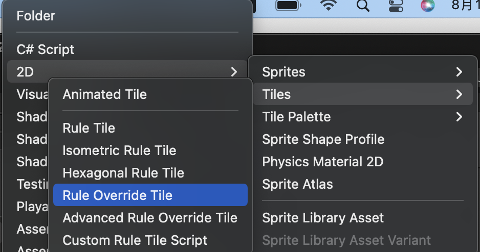

挂载需要覆盖的Rule Tile，再替换sprite即可

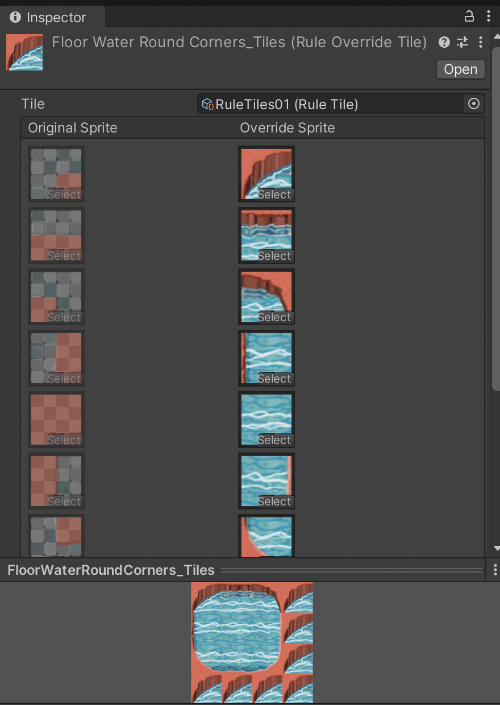

### (6) Advanced Rule Override Tile

即可以更改之前的规则

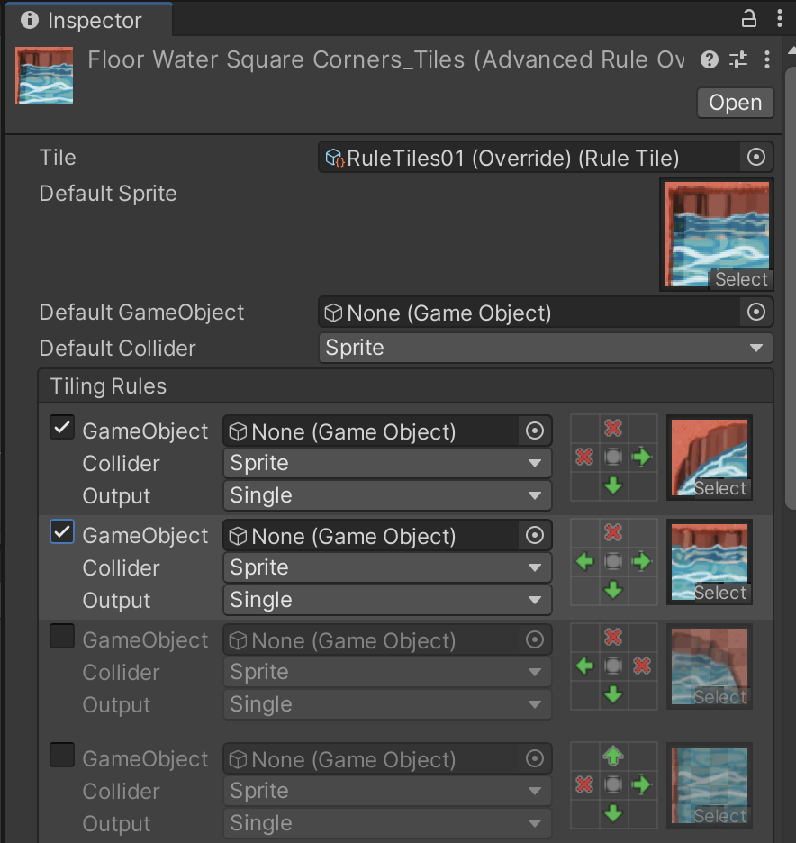


---

## 3. Tilemap Renderer

### (1) Additional Settings中可以order in layer，即直接设置不同层，数值大的在前，

### (2) 伪透视效果（相同层设置渲染顺序）

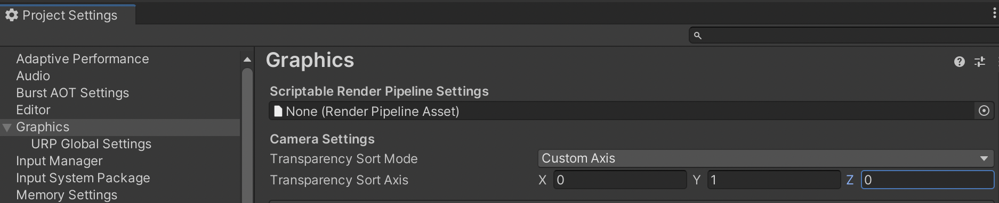

不使用渲染管线才有Camera Settings这个属性选项；此时mode选为**Custom Axis**，Axis设为(0，1，0)；此时根据game object的y值大小渲染，y值大的在前

然后将game object的**Sprite Renderer**组件的**Sprite Sort Point**设为按照**Pivot**

再到sprite的**Sprite Mode**中修改**Pivot**或打开**Sprite Edit**设置**Pivot**

### (3) 平铺

首先将gobj的scale设为1，1，1；

然后将打开sprite，Sprite Mode --> Mesh Type设为Full Rect

再打开gobs， Sprite Render --> Draw Mode设为Tiled

此时使用Rect Tool（快捷键为T）即可实现平铺（可勾选collider --> Auto Tiling，碰撞器即随着平铺变化）

---

## 其他

```c#
QualitySettings.vSyncCount = 0;// 垂直同步计数设为0，锁帧才有效
Application.targetFrameRate = 10;// 锁帧
```

