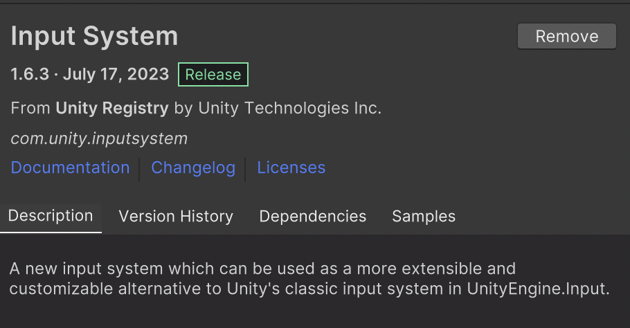
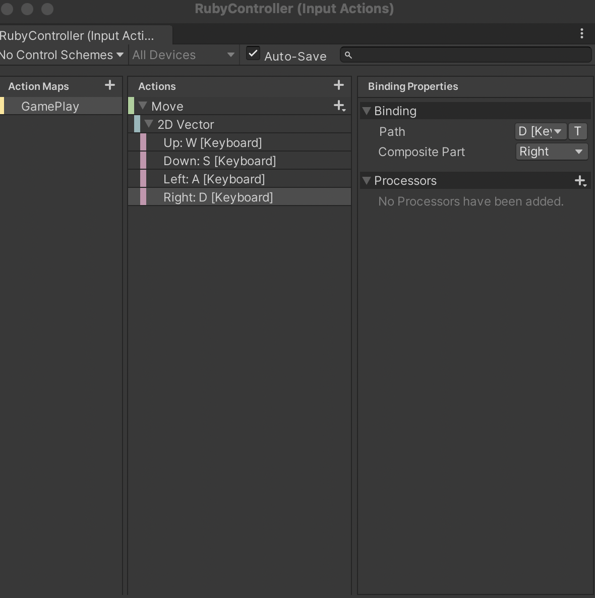
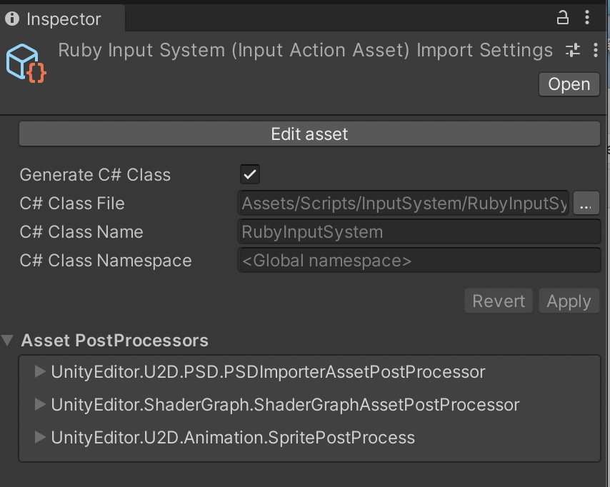
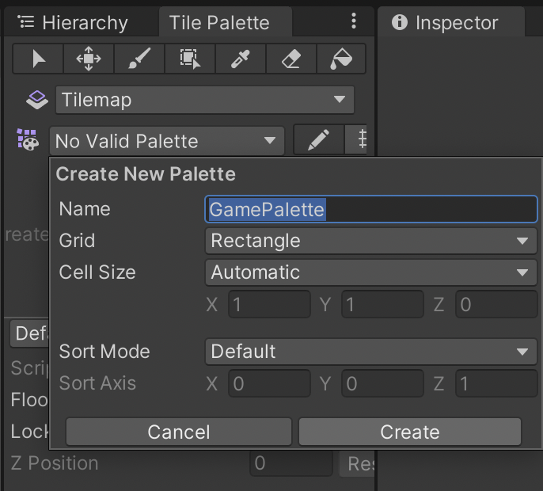
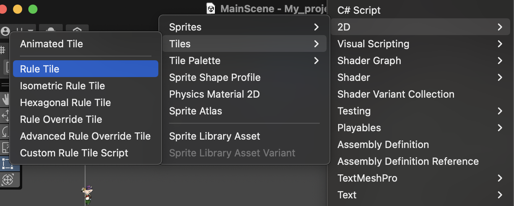
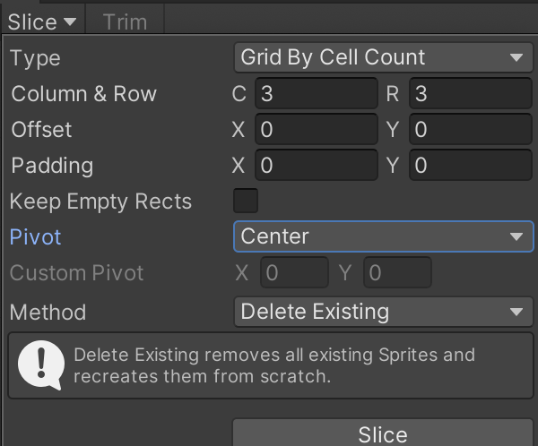
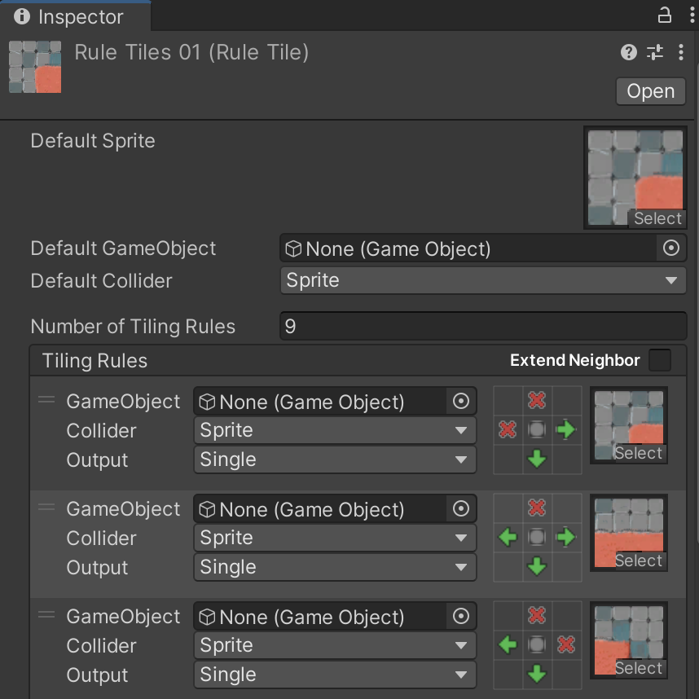

## 1.Input system




### (1) 移动





```c#
private RubyInputSystem inputSystem;
public float speed;

private void Awake()
{
    inputSystem = new RubyInputSystem();
}

private void OnEnable()
{
    inputSystem.Enable();
}
private void OnDisable()
{
    inputSystem.Disable();
}

private void Update()
{
    Vector2 direction = inputSystem.GamePlay.Move.ReadValue<Vector2>();
        
    transform.position += (Vector3)direction * speed * Time.deltaTime;
}

```

---

## 2.Tile Map

### (1) 新建Tilemap


### (2) 新建Palette



### (3) 创建Tile



创建完后添加sprite，注意Pixels Per Unit设置为和图像相同的大小，如64乘64就设为64、16乘16就设为16；如果是组合图片，首先设置sprite mode为multiple，再使用总像素除以切分的数量得出pixel per unit（192乘192 / 9 = 64乘64））

创建好后将Tile拖入Pattle即可

### (4) Rule Tile






---

## 3. Tilemap Renderer

Additional Settings中可以order in layer，数值大的在前


---

## 其他

```c#
QualitySettings.vSyncCount = 0;// 垂直同步计数设为0，锁帧才有效
Application.targetFrameRate = 10;// 锁帧
```

