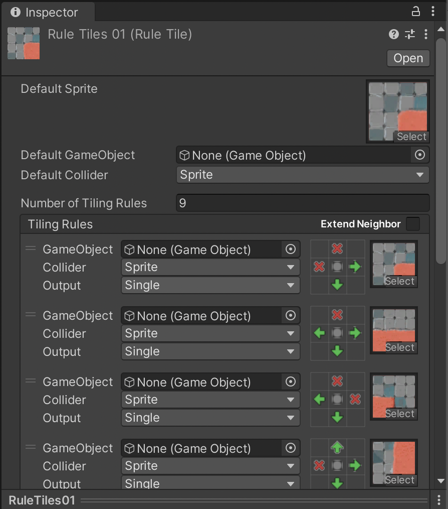

需要物理特性时添加rigid body组件

需要碰撞检测时添加collider组件

要发生碰撞，碰撞双方中其中一方应该有刚体组件(碰撞是基于物理系统的)

## Rigid Body

### （1）处理旋转

**RigidBody2D** --> **Constrains** --> 启用**Freeze Rotation**复选框, 以告知刚体不向gobj添加旋转

### （2）处理抖动

如果使用transform.position移动gobs，那么会发生移动position，gobj和另一个碰撞体重叠，物理系统将gobj移出重叠部分，即发生抖动

```c#
// 改用物理系统移动刚体
private void Update()
{
		//应该在每帧更新时获取输入
		Vector2 direction = inputSystem.GamePlay.Move.ReadValue<Vector2>();
}
private void FixedUpdate()// Project Settings --> Time --> Fixed Timestep
{
    // 在FixUpdate中影响物理组件或对象，保持物理计算的稳定
    Vector3 position = transform.position;
    position += (Vector3)direction * speed * Time.deltaTime;;
    rb.MovePosition(position);
}

```

### （3）Sleep Mode

Rigidbody 2D --> Sleep Mode: never sleep, start awake, start asleep

设为never sleep:  物理系统始终计算刚体的碰撞

设为start awake:  Rigidbody2D is initially awake. 刚体停止移动时，物理系统停止计算刚体的碰撞

设为start asleep: Rigidbody2D is initially asleep. 可以被碰撞唤醒。刚体停止移动时，物理系统停止计算刚体的碰撞

---

## Collider

### (1) 瓦片碰撞体

点击Hierarchy中的Grid下的瓦片地图gobj，添加Tilemap Collider 2D组件，此时所有瓦片gobs都会添加上单独碰撞体，可以在Projects的瓦片中设置碰撞为none或者sprite，设为sprite即启用碰撞体



也可以为不同逻辑的map对象设置为不同的tile map，分别选择是否添加碰撞体组件

#### **组合碰撞体**(**Composite Collider 2D**)

为Tilemap添加**Composite Collider 2D**组件（将该对象即其子对象的所有碰撞体合并为一个碰撞体），此时会自动添加Rigidbody 2D组件，作为地图一般设置Body Type为Static

about Body Type: [Unity - Scripting API: RigidbodyType2D (unity3d.com)](https://docs.unity3d.com/ScriptReference/RigidbodyType2D.html)

然后在Tilemap Coiilder 2D中将**Used By Composite**的复选框选中


```c#
// 施加力
rb.AddForce(Vector2.up,ForceMode2D.Impulse);
rb.AddForce(Vector2.up,ForceMode2D.ForceMode2D.Force);

private void OnCollisionEnter2D(Collision2D collision)// 碰撞触发函数
{
		Debug.Log(collision.collider.name);
}

private void OnTriggerEnter2D(Collider2D collider)
{
		Debug.Log(collider.name);
}
```

